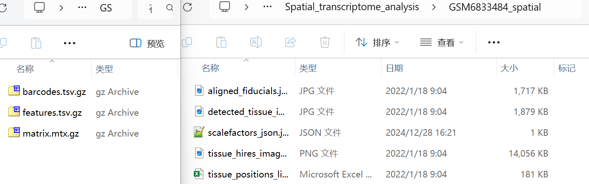
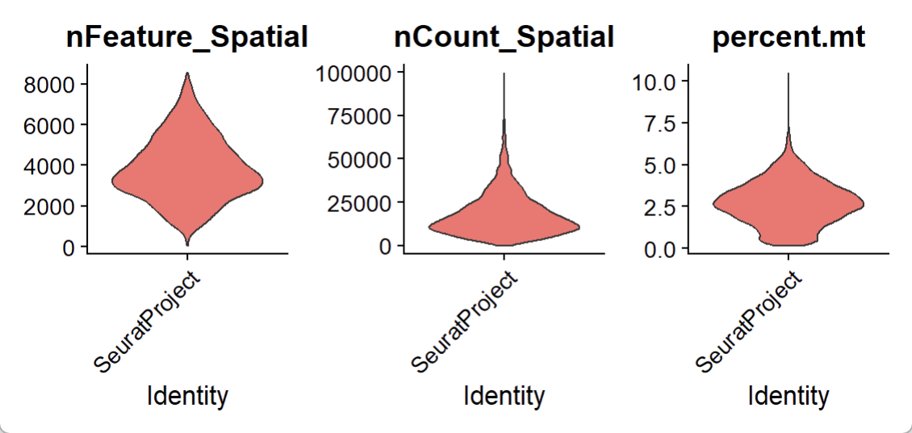
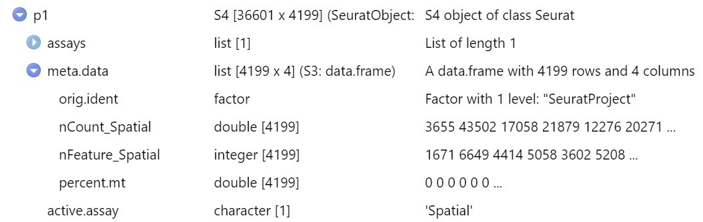
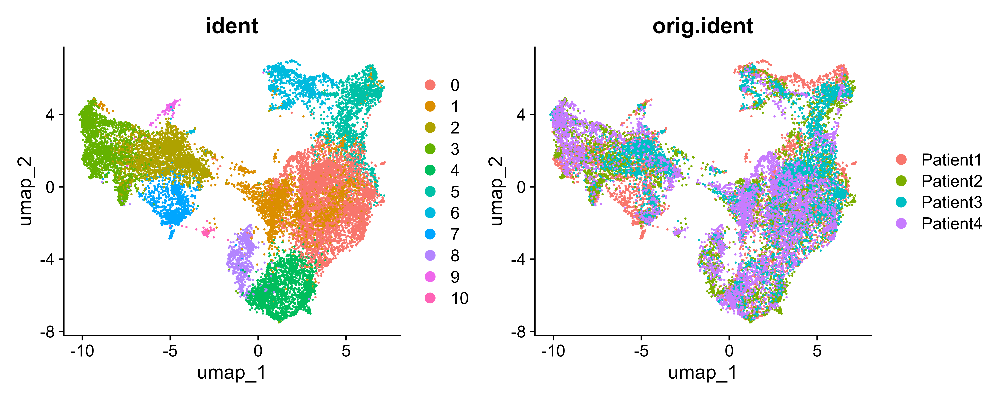

<h1>10×Visium ST Analysis Tutorial</h1>


<h3>10× Genomics Visium ST Sequencing Downstream Analysis Could Include: </h3>
    1. Normalization标准化 <br>
    2. Dimensional reduction and clustering降维和聚类 <br>
    3. Detecting spatially-variable features检测空间可变特征 <br>
    4. Interactive visualization交互可视化 <br>
    5. Integration with single-cell RNA-seq data与单细胞RNA-seq数据整合 <br>
    6. Working with multiple slices处理多个切片; etc. <br>
<br>

以[Zhi et al., 2024](https://onlinelibrary.wiley.com/doi/10.1002/advs.202306515)的数据为例，开展空间转录组分析：

<h4>1. 数据输入，构建Seurat对象</h4>

```R
p1 <- CreateSeuratObject(counts = Read10X("./GSM6833484/"), assay = "Spatial")
p1_spatial <- Read10X_Image(image.dir = file.path("./GSM6833484_spatial/"), 
                            image.name = "tissue_hires_image.png",
                            assay = "Spatial", filter.matrix = TRUE)
p1_spatial <- p1_spatial[Cells(x = p1)]
DefaultAssay(p1 = p1_spatial) <- "Spatial"
p1[["slice1"]] <- p1_spatial
SpatialFeaturePlot(p1, features = "nFeature_Spatial")
```
在GSM6833484文件夹下有`barcodes.tsv.gz`、`features.tsv.gz`、`matrix.mtx.gz`三个文件；
在GSM6833484_spatial下有切片图片、测序位置信息文件`tissue_positions_list.csv`、切片分辨率信息文件`scalefactors_json.json`。

出现错误1：无法读取图片
```R
Error in png::readPNG(source = file.path(image.dir, image.name)) : 
  unable to open ./GSM6833484_spatial/tissue_lowres_image.png
```
解决策略1：检查GSM6833484_spatial文件夹，发现确实没有tissue_lowres_image.png这站图片，但是有tissue_hires_image.png这张图片，说明作者只上传了高分辨率图片；Read10X_Image默认读取低分辨率图像。因此，可以在Read10X_Image中指定图像路径，添加`image.name = "tissue_hires_image.png"`，问题解决。

出现错误2：`SpatialFeaturePlot`后图像移位<br>
解决策略2.1：Read10X_Image默认读取低分辨率图像，虽然通过`image.name = "tissue_hires_image.png"`强行读取了高分辨率图像，但是图像处理参数仍旧使用低分辨率图像来进行，因此会出现图片只显示了一部分的情况。因此，需要修改原始切片分辨率信息文件`scalefactors_json.json`，将tissue_lowres_scalef的值手动覆盖为tissue_hires_scalef，问题解决。<br>
解决策略2.2：修改参数`image. scale = lowres`或也能解决该问题。

> 怎么理解Seurat对象：[为什么要以数据库的思维来理解单细胞数据](https://www.jianshu.com/p/13142bf51e81)、[认识Seurat对象数据结构/数据格式及操作](https://www.jianshu.com/p/0c4bc6a932b2)

<h4>2. 数据预处理</h4>
检查Seurat对象中的feature数与counts数，以及线粒体RNA的占比

```R
p1[["percent.mt"]] <- PercentageFeatureSet(p1, pattern = "^MT-")
VlnPlot(p1, features = c("nFeature_Spatial", "nCount_Spatial", "percent.mt"), 
        ncol = 3, group.by = "orig.ident", pt.size = 0)
p1 <- subset(p1, subset = nCount_RNA < 50000 & percent.mt < 7.5)
```
过滤数据只是为了去掉离群点，因此阈值设置因小提琴图结果而异。

出现错误1：原代码`features = c("nFeature_RNA", "nCount_RNA", "percent.mt")`会出现报错如下
```R
Warning: Default search for "data" layer in "Spatial" assay yielded no results; utilizing "counts" layer instead.
Error in `FetchData()`:
! None of the requested variables were found: nFeature_RNA, nCount_RNA, percent.mt
Run `rlang::last_trace()` to see where the error occurred.
```
解决策略1：
1. 首先明确`Default search for "data" layer in "Spatial" assay yielded no results; utilizing "counts" layer instead`并不是错误源头，包在发现没有data layer之后已经自动使用counts layer替代。<br>
2. 出错原因在于没有理解Seurat对象的结构，生搬scRNA-seq的结果。在ST中，assay中的层叫`nFeature_Spatial`、`nCount_Spatial`，而不是`nFeature_RNA`、`nCount_RNA`，因此直接修改画图时指定的对象名称即可，错误解决。


出现错误2：`pattern = "^mt-"`匹配不到线粒体基因<br>
解决策略2：检查基因名，发现线粒体基因的MT大写，修改为`pattern = "^MT-"`，错误解决。


<h4>3. 归一化</h4>

提示：安装`glmGamPoi`使得SCTransform速度提升
```R 
p1 <- SCTransform(p1, assay = "Spatial", verbose = FALSE)
#SpatialFeaturePlot(p1, features = c("KRT17"), alpha = c(0.1, 1))
p1 <- FindSpatiallyVariableFeatures(p1, assay = "SCT", features = VariableFeatures(p1)[1:1000],
                                    selection.method = "moransi")
```
可以画图检查marker基因表达情况
`FindSpatiallyVariableFeatures`：寻找位置特异的高变基因；
`FindVariableFeatures`：单细胞常用的寻找高变基因在SCTransform中就已经完成。
可以保存RDS，下次分析时可以快速调用。

<h4>4. 合并数据</h4>

多个数据合并时，应该注意在构建seurat对象时给数据加上label
简单来说就是`CreateSeuratObject`时加入`project = ""`、`Read10X_Image`时加入`slice = ""`
```R
p1 <- CreateSeuratObject(counts = Read10X("./GSM6833484/"), assay = "Spatial", project = "Patient1")
p1_spatial <- Read10X_Image(image.dir = file.path("./GSM6833484_spatial/"), 
                            image.name = "tissue_hires_image.png", slice = "slice1",
                            assay = "Spatial", filter.matrix = TRUE)
```

合并数据只能逐条合并 (sequenial merge):
```R 
OSCC_merge <- merge(p1, p2)
OSCC_merge <- merge(OSCC_merge, p3)
OSCC_merge <- merge(OSCC_merge, p4)
DefaultAssay(OSCC_merge) <- "SCT"
VariableFeatures(OSCC_merge) <- c(VariableFeatures(p1), VariableFeatures(p2),
                                  VariableFeatures(p3), VariableFeatures(p4))
##saveRDS(OSCC_merge, "./OSCC_merge.rds")
```

<h4>4. 降维、聚类</h4>

使用harmony去除批次效应
```R
OSCC_merge <- RunPCA(OSCC_merge, verbose = FALSE)
OSCC_merge <- RunHarmony(OSCC_merge, dims = 1:30, "orig.ident", verbose = FALSE)
##ElbowPlot(OSCC_merge, ndims = 50)
##DimHeatmap(OSCC_merge, dims = 1:10, cells = 500, balanced = TRUE)
OSCC_merge <- FindNeighbors(OSCC_merge, dims = 1:30, reduction = "harmony")
OSCC_merge <- FindClusters(OSCC_merge, verbose = FALSE, resolution = 0.35) #
OSCC_merge <- RunUMAP(OSCC_merge, reduction = "harmony", dims = 1:30)
DimPlot(OSCC_merge, reduction = "umap", group.by = c("ident", "orig.ident"))
SpatialDimPlot(OSCC_merge, image.alpha = 0.5, pt.size.factor = 2)
SpatialFeaturePlot(OSCC_merge, features = c("SPP1", "SLURP2"), image.alpha = 0.5, pt.size.factor = 2)
```



